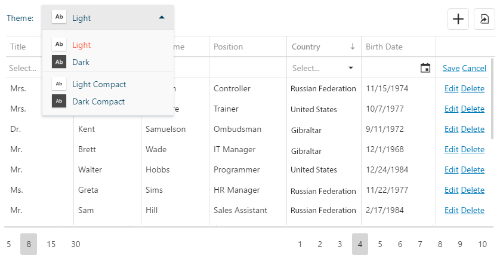

# test-js-2017
## Тестовое задание № 1

Необходимо реализовать несколько функций и тесты к ним.  
Файл для реализации c описанием [тут](./packages/core/src/task.js)  
В качестве примера реализован [тест](./packages/core/__tests__/task/sequence.js) для функции sequence


## Тестовое задание № 2

Необходимо реализовать CRUD приложение используя React
1. Постраничная навигация
2. Добавление и редактирование в строке таблицы (Row Editing)
3. Сортировка
4. Изменение порядка колонок в таблице
5. Скроллинг только данных (шапка на месте)
6. Экспорт в файл (формат на ваше усмотрение)
7. Темы (Скины) приложения. Расположение исходников и выбор CSS препроцессора на ваше усмотрение
8. Пару тестов для React компонентов.

- В качестве хранилища воспользуйтесь localStorage.
- Место для исходников React компонентов [тут](./packages/components/src), а для тестов к ним [тут](./packages/components/__tests__) 
- Для ускорения процесса разработки вы можете воспользоваться дополнительными модулями.
- Доработать и оптимизировать конфигурацию сборки.
- Использование декораторов приветствуется.

Модель данных **Person**:
- Title - Выпадающий список
- FirstName - строка
- LastName - строка
- Position - строка
- Country - Выпадающий список
- BirthDate - дата

Данные для выпадающих списков вы можете получить подключив модуль [@tpro/core/utils/enums](./packages/core/src/utils/enums.js)
```javascript
import * as Enums from '@tpro/core/utils/enums'
```
Для поля Title - воспользуйтесь Enums.person_title  
Для поля Country - Enums.country  
Обратите внимание, что данные функции возвращают Promise объект, а при первом вызове resolve срабатывает через 1 секунду.


### Пример желаемого результата
 


## Структура

    └── application/ 
    │   └── src/main.jsx - Точка входа в приложение
    ├── packages/
    │   ├── components/ - Пакет для React компонентов
    │   └── core/ - Flux, утилиты, работа с хранилищем, ...
    ├── config/ - папка с конфигурационными файлами для сборки
    └── build.js - исполняющий файл сборки


## Тестирование
```sh
# Запуск всех тестов
npm test
```
## Сборка
```sh
# Вывод справки
node build -h

# Сборка develop версии
node build 

# Сборка develop версии с отслеживанием изменений
node build -W

# Сборка production версии 
node build -P
```
Тестовый сервер вы можете настроить на свое усмотрение или воспользоваться [node-static](https://github.com/cloudhead/node-static)
```sh
# Установка
$ npm install -g node-static

# Запуск
$ static _build -p 8000
serving "_build" at http://127.0.0.1:8000
```


